<h1 align="center">Fraud Radar</h1>

<p align="center">
  <strong>A real-time card-fraud detection platform, and an honest evaluation of whether its model actually generalises.</strong>
</p>

<p align="center">
  <a href="https://github.com/apoorvrajdev/fraud-radar/actions/workflows/ci.yml"></a>
  
  
  
  
  
  
  
</p>

<p align="center">
  <a href="https://fraud-radar-lilac.vercel.app"><strong>Live demo</strong></a> ·
  <a href="backend/ml/BENCHMARK_CARD.md">Benchmark card</a> ·
  <a href="backend/ml/ULB_BENCHMARK_CARD.md">Real-data card</a> ·
  <a href="docs/ARCHITECTURE.md">Architecture</a> ·
  <a href="https://www.loom.com/share/a4fb7eb81ba7496e80e300a36c41617b">Walkthrough</a>
</p>

---

Transactions arrive over HTTP, get scored by a rules engine plus an XGBoost model in single-digit milliseconds, carry a SHAP attribution for every decision, and land in an analyst review queue with an append-only audit trail. That is the product.

The part I care more about is the second half: the same model was then evaluated against an independently generated corpus, carried across generators without retraining, tested for temporal drift, audited rule-by-rule, and set beside a real anonymised card dataset on an isolated track. **The cross-generator transfer result is bad, it is reported here in full, and it is the most useful thing in the repository.**

## At a glance

| | |
|---|---|
| **Product** | FastAPI backend · React 19 + TypeScript dashboard · SQLAlchemy 2.0 (SQLite dev, Postgres-compatible schemas) · static-snapshot demo on Vercel |
| **Scoring** | 6 deterministic rules → 17-feature extractor → XGBoost → SHAP → conservative-wins decision, at service-layer p50 **3.7 ms** / p95 **5.8 ms** |
| **Served model** | Trained on this repository's own generator (`synthetic_v1`, featureset `v1`), operating threshold **0.7431** chosen on a validation fold. No benchmark run has been promoted |
| **In-distribution** | PR-AUC **0.9327** on a held-out chronological fold of the generator it was trained on |
| **Cross-generator transfer** | PR-AUC **0.0087** against a test prevalence of 0.0033 — see [what the evaluation taught us](#what-the-evaluation-taught-us) |
| **Real anonymised data** | ULB, 284,807 rows / 492 frauds, on its own isolated PCA featureset. PR-AUC **0.7670** (primary seed). Never promoted, never merged with the above |
| **Verification** | 1,407 tests · `ruff` · `mypy --strict` · every benchmark run reproducible from committed records |

---

## Contents

- [The problem](#the-problem) · [What I built](#what-i-built) · [Architecture](#architecture) · [The scoring pipeline](#the-scoring-pipeline)
- [How it was evaluated](#how-it-was-evaluated) · [Results](#results) · [**What the evaluation taught us**](#what-the-evaluation-taught-us)
- [Production engineering](#production-engineering) · [Explainability and the analyst loop](#explainability-and-the-analyst-loop) · [Multi-currency](#multi-currency)
- [Limitations](#limitations) · [Data provenance](#data-provenance-and-licensing) · [Why this is not a Kaggle notebook](#why-this-is-not-a-kaggle-notebook)
- [Repository layout](#repository-layout) · [Running it locally](#running-it-locally) · [Roadmap](#roadmap)

---

## The problem

A fraud classifier is the easy part. The systems that actually run in payments have to do several things a notebook never does:

- **Decide in milliseconds**, synchronously, on the authorisation path.
- **Explain every decision**, because a declined customer becomes a support ticket and a regulator eventually asks why.
- **Survive retries** — a network timeout must not double-charge or double-block.
- **Keep a human in the loop**, because no production fraud system runs fully automated.
- **Leave an audit trail** that still makes sense years later.
- **Keep working when a dependency is down**, rather than failing the payment.

And underneath all of it: a model trained on data that resembles production only as closely as whoever built the dataset managed. That last problem is the one this repository spends the most effort on.

## What I built

An end-to-end system, not a notebook:

- A **FastAPI** service with a layered architecture (`api → services → repositories → models`), Stripe-pattern idempotent ingestion, synchronous hybrid scoring, a keyset-paginated transactions API, a purpose-built alerts queue, and an append-only audit log.
- A **React 19 + TypeScript** dashboard: live KPIs, a filterable transaction feed, a per-transaction detail page with SHAP attribution and the analyst decision form, and an alerts worklist.
- An **offline ML pipeline** that is strictly separated from the serving path — dataset adapters, a batch feature builder that calls the *production* extractor, training, evaluation, and per-run reproducibility records.
- A **benchmark programme** with its methodology frozen in ADRs *before* the data was scored, producing two generated cards that no one hand-edits.
- A **currency enrichment layer** built on the assumption that its external provider will be unavailable.

## Architecture

```mermaid
flowchart TB
    subgraph live["LIVE — serving path"]
        direction TB
        UI["React 19 + TypeScript dashboard<br/>overview · transactions · detail · alerts"]
        API["FastAPI · Pydantic v2 · Idempotency-Key"]
        UI -->|HTTPS / JSON| API

        API --> TXA["/transactions"]
        API --> ALA["/alerts"]
        API --> STA["/stats/*"]
        API --> MDA["/model"]

        TXA --> FX["enrichment/fx<br/>historical rate + cache<br/><i>never blocks scoring</i>"]
        TXA --> SVC["services/<br/>scoring · idempotency · review"]
        ALA --> SVC
        STA --> SVC

        SVC --> FEAT["FeatureExtractor<br/>17 features"]
        SVC --> RULES["Rules engine<br/>6 pure rules"]
        FEAT --> XGB["XGBoost"]
        XGB --> SHAP["SHAP TreeExplainer"]
        RULES --> DEC{"Decision<br/>conservative wins"}
        SHAP --> DEC
        DEC --> AUD["Audit log<br/>append-only"]
        DEC --> QUEUE["Analyst review queue"]

        SVC --> REPO["repositories/ → SQLAlchemy 2.0"]
        REPO --> DB[("SQLite dev<br/>Postgres-ready")]
    end

    subgraph offline["OFFLINE — never runs in the API process"]
        direction TB
        SRC["Synthetic generator · Sparkov CSVs · ULB CSV<br/><i>external corpora gitignored, SHA-256 pinned</i>"]
        SRC --> ADPT["dataset adapters → canonical records<br/>labels held outside the objects"]
        ADPT --> BATCH["batch feature builder<br/><b>calls the same FeatureExtractor</b>"]
        BATCH --> TRAIN["train → tune → threshold on val → score test once"]
        TRAIN --> RUNS[("runs/&lt;name&gt;/<br/>run.json · metrics · threshold")]
        RUNS --> EXP["transfer · temporal drift · rules audit"]
        EXP --> CARDS["BENCHMARK_CARD.md<br/>ULB_BENCHMARK_CARD.md<br/><i>generated from records</i>"]
    end

    SIM["Transaction simulator<br/>HTTP client, optional currency mix"] -->|POST| API
    RUNS -.->|"promote — built, never run"| ART[("ml/artifacts/<br/>model.json + threshold")]
    ART -.->|"loaded once at startup"| XGB
    DB -.->|"export snapshot"| DEMO["Vercel static demo<br/>frozen JSON, no backend"]

    style live fill:#0d1117,stroke:#30363d
    style offline fill:#0d1117,stroke:#30363d
    style DEC fill:#1f2937,stroke:#4b5563
```



The two halves touch at exactly one place: the artifact directory. Offline produces it, live loads it. **Training never needs the API, and the API never needs the training data.**

Fuller diagrams — runtime topology, the end-to-end scoring sequence, the analyst-review loop with its cache wiring, and the layered code structure — are in [`docs/ARCHITECTURE.md`](docs/ARCHITECTURE.md).

## The scoring pipeline

```
transaction
   → FX enrichment          derived reporting amount; cannot raise
   → rules engine           6 pure rules; HARD_BLOCK short-circuits the model
   → feature extraction     17 features over a 180-day customer history window
   → XGBoost                raw binary:logistic score in [0, 1]
   → SHAP                   top contributors, computed at inference time
   → decision               conservative wins: APPROVE · REVIEW · DECLINE
   → audit log              actor, action, payload, immutable
   → analyst queue          human verdict can override; model verdict preserved
```

Two design choices worth calling out.

**The model score is deliberately not described as a calibrated probability.** It is a ranking signal against a threshold. Calibration is *measured* on the held-out fold — Brier, ECE, and positive-class variants that strip out the well-calibrated negative mass — and reported in the cards, but no calibrator is ever fitted. Applying a Platt or isotonic step is named as a follow-up, not done.

**Training calls the production feature extractor.** The batch builder in `ml/features/` invokes the same `FeatureExtractor.extract()` the API calls, with the same 180-day history window, behind a sentinel session that raises if anything tries to reach a database. A golden parity test compares batch against the serving path element by element with exact float equality, on a fixture where no feature is constant — because parity on a column that never varies proves nothing. Train/serve skew is the bug that quietly destroys fraud-model precision in production, and the only durable fix is one code path. Design in [`PHASE_5C_FEATURE_PARITY.md`](docs/adr/PHASE_5C_FEATURE_PARITY.md).

## How it was evaluated

The headline number of a fraud project is usually computed on the same generator that produced its training data, which measures how learnable that generator is — not how detectable fraud is. Phase 5 exists to break that loop, using four evaluations that are **never merged and never averaged**:

| Layer | Data | What it can answer |
|---|---|---|
| **In-house synthetic** | This repository's generator: 50,010 transactions, 500 customers, 200 merchants, 1.52% fraud, six injected patterns, `seed=42` | Is the pipeline correct end to end? Nothing about the real world |
| **Sparkov** | An [independent generator](https://www.kaggle.com/datasets/kartik2112/fraud-detection) (Brandon Harris's Sparkov), 1,852,394 rows. **Simulated, not real card transactions** | Do features designed against my own simulator work on someone else's? |
| **Cross-generator transfer** | The synthetic model, unchanged, on Sparkov's test fold | Does in-distribution performance survive a change of data-generating process? |
| **ULB** | [Real, publisher-anonymised card data](https://www.kaggle.com/datasets/mlg-ulb/creditcardfraud): 284,807 rows, 492 frauds (0.17%), features are PCA components the publisher withholds the inputs to | What does real data look like — on a track that cannot contaminate production? |

Both benchmark methodologies were **frozen in ADRs before any test fold was scored** ([5D](docs/adr/PHASE_5D_BENCHMARK_METHODOLOGY.md), [5E](docs/adr/PHASE_5E_ULB_BENCHMARK_METHODOLOGY.md)). Every run writes a record — `run.json`, metrics, threshold, provenance — and those records are committed, so any number below traces back to a run that can be rebuilt and re-verified. Verification refuses a run whose re-derived test fold holds other transactions, the same ones in another order, or whose model file is not byte-for-byte the one it saved. The cards are **generated from the records**, not written by hand.

## Results

Every row below states what its model was trained on, what it was evaluated on, and where its threshold was chosen. **Read each PR-AUC against the test prevalence beside it** — a scorer with no signal scores about the prevalence. These are four different populations; ranking them against each other would be meaningless.

### A. In-distribution — trained and evaluated on the same corpus

| Result | Test rows | Test frauds | Prevalence | PR-AUC | ROC-AUC | Recall @ 1% FPR | Recall @ 5% FPR |
|---|---|---|---|---|---|---|---|
| Synthetic baseline (`synthetic_v1`) | 7,502 | 93 | 0.0124 | **0.9327** | 0.9989 | 0.9785 | 1.0000 |
| Sparkov, 200-card development run | 53,922 | 159 | 0.0029 | **0.9196** | 0.9985 | 0.9748 | 0.9937 |
| Sparkov, full corpus (999 cards) | 277,860 | 924 | 0.0033 | **0.8653** | 0.9963 | 0.9459 | 0.9838 |

At each operating threshold, chosen on that run's own validation fold at FPR ≤ 1%:

| Result | Threshold | Precision | Recall | F1 | Realised test FPR |
|---|---|---|---|---|---|
| Synthetic baseline | 0.7431 | 0.6138 | 0.9570 | 0.7479 | 0.0076 |
| Sparkov, development | 0.5286 | 0.2710 | 0.9748 | 0.4241 | 0.0078 |
| Sparkov, full corpus | 0.2373 | 0.2592 | 0.9361 | 0.4060 | 0.0089 |

### B. Cross-generator transfer — the result that matters

> **Model trained on the in-house synthetic generator → evaluated on Sparkov's test fold, not retrained.**
> Nothing was selected on Sparkov data: no threshold, no calibration, no feature selection, no tuning.

| | Test rows | Test frauds | Prevalence | PR-AUC | ROC-AUC | Recall @ 1% FPR | Recall @ 5% FPR |
|---|---|---|---|---|---|---|---|
| synthetic_v1 → sparkov_v1_full | 277,860 | 924 | 0.0033 | **0.0087** | 0.7354 | 0.0390 | 0.0530 |

Applying the source model's own threshold (0.7431) unchanged to the target fold:

| Precision | Recall | F1 | TP | FP | TN | FN | Realised FPR |
|---|---|---|---|---|---|---|---|
| 0.0030 | 0.0628 | 0.0057 | 58 | **19,215** | 257,721 | 866 | 0.0694 |

**A PR-AUC of 0.0087 against a prevalence of 0.0033 is barely better than chance.** Read the two previous tables together: the same 17 features, retrained on Sparkov, reach 0.8653. Carried over without retraining, they reach 0.0087 and flag 19,215 legitimate transactions to catch 58 frauds.

### C. ULB — real anonymised data, isolated track

Three pre-registered random states, shown side by side and **never averaged**. Seed 42 is the primary; 43 and 44 are its pre-registered repeats, so they show how much a result moves with the fit's randomness — not a confidence interval.

| Run | Role | Test rows | Test frauds | Prevalence | PR-AUC | ROC-AUC | Recall @ 1% FPR | Recall @ 5% FPR |
|---|---|---|---|---|---|---|---|---|
| `ulb_pca_v1_seed42` | primary | 42,722 | 52 | 0.0012 | **0.7670** | 0.9751 | 0.8269 | 0.8654 |
| `ulb_pca_v1_seed43` | repeat | 42,722 | 52 | 0.0012 | 0.7569 | 0.9760 | 0.8077 | 0.8462 |
| `ulb_pca_v1_seed44` | repeat | 42,722 | 52 | 0.0012 | 0.7751 | 0.9803 | 0.8462 | 0.8846 |

ULB runs on its own featureset, `ulb_pca_v1` — the 28 published components plus the amount, as published — which is deliberately **kept out of the production 17-feature registry, so a ULB run can be neither promoted nor served**. The test fold holds 52 frauds among 42,722 rows, so a handful of rows moves every figure on that card.

### D. Temporal drift

A model of its own, tuned and fitted on 2019-01 → 2019-10, threshold selected **once** on 2019-11 → 2019-12, then scoring each month of 2020 at that fixed threshold. Twelve months, no re-selection:

| | Jan | Mar | May | Jul | Sep | Nov | Dec |
|---|---|---|---|---|---|---|---|
| PR-AUC | 0.9147 | 0.9084 | 0.9276 | 0.8054 | 0.8981 | 0.8711 | 0.8047 |
| Recall | 0.9650 | 0.9527 | 0.9696 | 0.9065 | 0.9441 | 0.9354 | 0.9341 |
| Precision | 0.3662 | 0.3609 | 0.3998 | 0.2610 | 0.3098 | 0.2731 | 0.1644 |

Recall holds between 0.906 and 0.970 across the year at a frozen threshold; precision decays from 0.40 to 0.16 as monthly prevalence falls from 0.0071 to 0.0018. That is the shape you would expect from a fixed threshold meeting a shifting base rate — the model's ranking stays usable while the operating point silently gets worse. Full twelve-month series in the [benchmark card](backend/ml/BENCHMARK_CARD.md#6-temporal-drift).

### E. Rules audit

The production rules, unmodified, evaluated on **all 1,852,394 Sparkov rows** (9,651 frauds), each row given the same 180-day context the scoring service builds:

| Rule | Severity | Fired | On fraud | Precision | Fraud recall |
|---|---|---|---|---|---|
| `off_hours_high_value` | REVIEW | 1,312 | 262 | 0.1997 | 0.0271 |
| `velocity_burst` | HARD_BLOCK | 72 | 4 | 0.0556 | 0.0004 |
| `amount_ceiling` | REVIEW | 195 | 0 | 0.0000 | 0.0000 |
| `geo_velocity_impossible` | HARD_BLOCK | 0 | 0 | — | 0.0000 |
| `high_risk_country` | REVIEW | 0 | 0 | — | 0.0000 |
| `dormant_account_high_value` | — | \- | \- | \- | **not evaluable** — Sparkov has no account-open timestamp |

Rules alone would APPROVE 1,850,815 of those rows, containing 9,385 of the 9,651 frauds. **The rules, calibrated against my own generator, catch almost nothing on someone else's data** — `high_risk_country` and `geo_velocity_impossible` never fire at all, because Sparkov carries no country signal those rules can use. A rule the data cannot support is reported as not evaluable rather than quietly run and scored as zero.

## What the evaluation taught us

**The central finding: in-distribution performance says almost nothing about whether a fraud model generalises.**

The same 17-feature pipeline scores PR-AUC 0.9327 on the generator it was trained on, 0.8653 when retrained on an independent generator, and **0.0087 when carried across generators without retraining**. The features are identical. The code is identical. Only the data-generating process changed.

Three things explain it, and they are worth separating:

1. **Five of the seventeen features are constant on Sparkov** — both country mismatches, account age, risk tier, and `is_high_risk_category`. The model leans on signal the target corpus simply does not carry.
2. **The operating threshold does not transfer either.** The synthetic run's 0.7431 was chosen for a 1% FPR on its own validation fold; on Sparkov it realises 6.94%, producing 19,215 false positives. A threshold is a property of a score distribution, not of a model.
3. **My generator contains structural associations the real world does not guarantee.** The clearest one is documented below.

### The country/fraud coupling — a documented property of the generator

While smoke-testing the demo I noticed every non-US country showing a ~100% decline rate. I traced it, and it is not a scoring or aggregation bug — it is how the data is made, at two independent layers:

- The **simulator** hard-codes `country = "US"` for clean payloads. Non-US countries appear *only* inside fraud patterns (`high_risk_country` → RU/CN/NG/RO/VE/ID, `stealth` → GB/DE/FR/JP/AU/CA). So P(fraud-shaped | non-US) = 1.0 by construction.
- The **training corpus** is worse: `COUNTRY_WEIGHTS` in the customer generator contains only `{US, GB, CA, DE, FR, AU, IN, BR, JP, MX}`, so RU/CN/NG/RO/VE/ID enter the 50,010 rows **exclusively** through the geo-velocity fraud injector. All 125 such rows are fraud. The model saw *zero* legitimate transactions from those countries.

Among countries that do appear legitimately, country is a weak signal (fraud rates 0.31%–2.79%). But for those six, the association is deterministic — which is exactly the kind of shortcut that produces a 0.9327 in-distribution and a 0.0087 in transfer.

> **To be explicit: this says nothing about real-world fraud rates by country.** It is an artefact of how this repository's synthetic data was constructed, and it is reported here because a generator's structural associations are precisely what a closed-loop evaluation hides. Correcting it would mean regenerating the dataset and retraining, which would move every published number — a deliberate future decision, not a quiet edit.

### What ULB does and does not add

ULB is **real** card data, so it answers a question no generator can. But its features are PCA components whose inputs the publisher withholds, which means the production featureset cannot be evaluated on it and its results cannot be compared with anything above. It therefore runs on a fully isolated track: its own loader, its own aggregate-only quality report, its own `ulb_pca_v1` featureset outside the production registry, its own trainer and read-only verifier. Its PR-AUC of 0.7670 at 0.12% prevalence is a real-data result about *that* featureset — not a statement about the served model, which has never seen it.

**Promotion is built, tested, and deliberately has never been run.** The model the API serves is still the synthetic-trained one, and the dashboard says so.

## Production engineering

**Ingestion and idempotency.** `POST /api/v1/transactions` requires an `Idempotency-Key`. Same key + same body replays the cached response with `X-Idempotency-Replay: true`; same key + different body returns 409. The cache key is a SHA-256 over `TransactionCreate(**body).model_dump_json()` — not raw HTTP bytes — so it is stable across whitespace and field reordering by intermediaries. 24-hour TTL.

**Scoring and audit.** One context load serves both the rules engine and the feature extractor (the 180-day window matches the longest rule lookback). A HARD_BLOCK short-circuits the model entirely. Every decision writes one audit row with the actor, the action, and the payload. Service-layer latency p50 3.7 ms / p95 5.8 ms; endpoint p50 16 ms / p95 20 ms including routing, validation, commit and serialisation (n=500, developer laptop — full distribution in [`latency_metrics.json`](backend/ml/artifacts/latency_metrics.json)).

**Money.** Every monetary value is `Decimal` end to end — ORM columns, Pydantic schemas, arithmetic. No `float` anywhere near an amount, including across the FX wire.

**Data layer.** SQLAlchemy 2.0 typed ORM, five Alembic migrations, CHECK constraints carrying real invariants (decision vocabularies, positive amounts, and an FX pairing constraint that makes a half-converted row impossible). SQLite in development; every column type maps 1:1 to PostgreSQL, so moving is a `DATABASE_URL` change plus an Alembic run.

**Reads.** Keyset pagination with opaque cursors on both the transactions list and the alerts queue — each with its own codec, because the alerts worklist sorts by `fraud_score DESC, created_at ASC, id ASC` and a shared encoder would have coupled two unrelated sort keys.

**The simulator** is a normal HTTP client to its own service: every transaction it writes goes through the rules engine, scorer, SHAP, audit log and idempotency cache exactly as any other client's would. `--currency-mix` spreads traffic across currencies to exercise the FX path.

**The demo** is a zero-cost, zero-cold-start static build: the React app reads a frozen JSON snapshot of the live API instead of a hosted backend. Decision recorded in [`PHASE_4A_DEMO_SCOPE.md`](docs/adr/PHASE_4A_DEMO_SCOPE.md); write actions render visibly disabled rather than faked.

## Explainability and the analyst loop

Every scored transaction carries its top SHAP contributors, computed at inference time against a `TreeExplainer` cached at startup — not pre-computed in batch. `GET /api/v1/transactions/{id}/explain` recomputes and returns the full 17-feature attribution map, with `?format=force` and `?format=waterfall` rendering the canonical SHAP plots as PNGs.

The **detail page deliberately does not recompute.** It reads what was persisted at scoring time — the row, the threshold in force, the rules that fired, the stored contributors with their direction pre-classified, the audit trail. Re-invoking the explainer there would show what the *current* model thinks, and a page backing an audit trail has to show what was actually decided.

`POST /api/v1/transactions/{id}/decision` records an analyst verdict: `CONFIRMED_FRAUD` projects to DECLINE, `CONFIRMED_LEGIT` to APPROVE, a null label falls through to the model's call. **The original `fraud_decision` column is preserved verbatim**, so the model's verdict stays clean for evaluation and retraining. Resubmitting the same verdict is idempotent; changing it writes an `ANALYST_DECISION_REVISED` audit row.

`GET /api/v1/alerts` is the queue feeding that loop, carrying a queue-wide summary block that deliberately ignores the caller's filters — queue health should describe the queue, not the current view.

## Multi-currency

A transaction keeps the amount and currency it was submitted in; FX enrichment attaches a derived reporting figure *beside* it, never over it. Rates come from [Frankfurter](https://frankfurter.dev) over ECB reference data, cached locally, and none of it is ever committed.

The contract ([`docs/FX_CONTRACT.md`](docs/FX_CONTRACT.md)) is short and the interesting parts are about being wrong:

- **Every cache read is constrained to `rate_date ≤ transaction date`**, which makes pricing a historical transaction at today's rate structurally unreachable rather than a rule someone has to remember. The stale fallback is therefore always an *older* rate, and the row records that it is.
- Weekends normalise back to the preceding Friday **before** the lookup, because the provider echoes whatever date you ask for and cannot tell you the true publication day.
- A provider outage costs a row its converted amount and nothing else — it is still scored, decided, persisted and audited, with `fx_source` recording which of `identity / live / cache / stale / unsupported / unavailable` answered, in the audit payload as well as on the row.
- Money never touches a binary float: rates parse with `parse_float=Decimal`, and the multiplication runs in a widened `Decimal` context so the product is formed exactly and rounded once.

Reporting aggregates sum `COALESCE(amount_base, amount)` because adding raw amounts across currencies adds euros to yen. Amount *filters* deliberately do not — "over 250" is a question about what the cardholder was charged. **The model never sees any of it**: the 17-feature registry and every benchmark track are untouched.

## Limitations

Stated plainly, because a results table without them is misleading:

- **The served model is trained on synthetic data.** Its 0.9327 PR-AUC measures how learnable this repository's generator is, not how detectable real fraud is.
- **Sparkov is simulated too.** It is an *independent* generator, which is what makes it useful, but it is not real card transactions and must never be described as such.
- **ULB is real but isolated.** Different featureset, different track, not promoted, not comparable to the rows above.
- **Transfer performance is poor** — PR-AUC 0.0087 — and that is reported rather than buried.
- **The generator has structural associations**, most clearly the country/fraud coupling documented above.
- **Label delay is not modelled.** The chronological split treats every training label as known at the validation boundary, whereas real fraud labels arrive days to months later via chargebacks. Every result here is optimistic in a way the benchmark does not measure.
- **Scores are not calibrated.** Calibration is measured, never fitted.
- **Demo traffic is not production traffic.** The snapshot is a few hundred synthetic rows generated in minutes at a 12% fraud rate; it is a UI fixture, not a sample of anything.
- **ULB's test fold holds 52 frauds.** A handful of rows moves every figure on that card.
- **The walkthrough video predates Phase 5** and shows the product before the benchmark, FX and badge work.

## Data provenance and licensing

Per-source licence, citation and provenance policy: [`docs/DATA_LICENSES.md`](docs/DATA_LICENSES.md).

What is committed: SHA-256 digests of every raw input, derived statistics, quality reports, metrics, run metadata, model cards. What is never committed: the raw corpora themselves, any row-level extract of a third-party dataset, feature matrices built from them. Because the raw bytes are absent, the file hash in each `run.json` is the durable link between a published number and the data that produced it — anyone can re-download, hash and compare.

Sparkov is CC0 (confirmed via the Kaggle API at retrieval). ULB is ODbL for the database and DbCL for its contents; its card carries the licence notice and the method offer those terms require. Frankfurter is queried at runtime and never downloaded into the repository at all.

## Why this is not a Kaggle notebook

Not a value judgement — just a different scope. The usual shape is *load CSV → train → report AUC*. This repository spends most of its effort on what comes after that:

| | |
|---|---|
| **Train/serve parity** | The trainer calls the production extractor; a golden test asserts element-by-element equality with the serving path |
| **Frozen methodology** | Both benchmark methods fixed in ADRs before any test fold was scored |
| **External validation** | An independent generator, plus real anonymised data on an isolated track |
| **Transfer measured** | And reported at PR-AUC 0.0087 rather than omitted |
| **Drift and rules audited** | Twelve months at a fixed threshold; all six rules over 1.85M rows, with one reported as not evaluable |
| **Reproducible records** | Every run rebuildable and verified against its own saved model, byte-for-byte |
| **Cards generated, not written** | Tests fail if a committed card drifts from its records |
| **Failure modes tested** | Provider timeouts, outages, malformed responses, stale rates, idempotency conflicts |
| **It is deployed** | And the dashboard states which model is serving and which datasets are benchmark-only |

## Repository layout

```
fraud-radar/
├── backend/
│   ├── app/                     # the only code that serves traffic
│   │   ├── api/v1/              # routers: transactions, alerts, stats, model
│   │   ├── services/            # scoring, idempotency, review, alerts, stats, model info
│   │   ├── enrichment/          # FX conversion + rate provider — the only outbound dependency
│   │   ├── repositories/        # SQLAlchemy data access
│   │   ├── models/              # ORM models (Decimal money, CHECK constraints)
│   │   ├── schemas/             # Pydantic v2 wire contracts
│   │   ├── fraud/               # FeatureExtractor, explainer, rules, decision matrix
│   │   └── simulator/           # HTTP client that feeds the live API
│   ├── ml/                      # offline only
│   │   ├── synthesis/           # the in-house generator (frozen as the v1 baseline)
│   │   ├── datasets/            # registry, pinned download, Sparkov adapter, quality report
│   │   ├── features/            # batch builder on the production extractor + cache
│   │   ├── experiments/         # transfer, temporal drift, rules audit
│   │   ├── tracks/ulb/          # the isolated real-data track
│   │   ├── artifacts/runs/      # per-run records (model.json gitignored)
│   │   ├── BENCHMARK_CARD.md    # generated from the records
│   │   └── ULB_BENCHMARK_CARD.md
│   └── tests/                   # 1,294 unit · 113 integration
├── frontend/                    # React 19 + TS dashboard; public/demo-data/ is the snapshot
├── scripts/export_demo_snapshot.py
└── docs/                        # ARCHITECTURE · FX_CONTRACT · DATA_LICENSES · PHASE_5_PLAN · adr/ (11)
```

## Running it locally

**Prerequisites:** Python 3.11+, Node 20.19+ or 22.12+ (the range Vite 8 declares), [`uv`](https://docs.astral.sh/uv/), Git.

```bash
# Backend — API at http://localhost:8000 (docs at /docs)
cd backend
uv sync
uv run alembic upgrade head
uv run uvicorn app.main:app --reload --port 8000

# Frontend — dashboard at http://localhost:5173
cd frontend
npm install
npm run dev
```

`fraud_radar.db` and the labelled CSV are gitignored; regenerate and train before the scoring endpoints will work:

```bash
cd backend
uv run python -m ml.generate_dataset   # ~2 min — seeds the DB, writes the labelled CSV
uv run python -m ml.train              # ~5–10 min — tunes, fits, evaluates, saves artifacts
uv run python -m ml.analyze            # ~1 min  — regenerates MODEL_CARD.md and analyses
```

With the backend up, feed it traffic:

```bash
uv run python -m app.simulator.main --rate 1 --fraud-rate 0.10
uv run python -m app.simulator.main --rate 1 --fraud-rate 0.10 \
  --currency-mix "USD:0.72,EUR:0.11,GBP:0.07,CAD:0.04,CHF:0.03,AUD:0.03"
```

Tests and checks — the same gate CI runs:

```bash
cd backend && uv run pytest              # 1,407 tests
cd backend && uv run ruff check app tests && uv run mypy app
cd frontend && npx tsc -b && npm run build
```

Reproducing the benchmarks (corpora are acquired locally and verified against pinned SHA-256 digests; neither is committed) is documented in the [benchmark card](backend/ml/BENCHMARK_CARD.md) and the [ULB card](backend/ml/ULB_BENCHMARK_CARD.md), with the full command set in [`docs/PHASE_5_PLAN.md`](docs/PHASE_5_PLAN.md).

**Refreshing the public demo** — run the backend locally, then:

```bash
uv run --project backend python scripts/export_demo_snapshot.py   # writes frontend/public/demo-data/
```

## Roadmap

**Phases 1–5 are complete.** The stack runs end to end, the demo is deployed, the benchmarks have been executed under frozen methodology and written up in generated cards, FX enrichment is in the live path, and the dashboard states its own model and data provenance.

<details>
<summary>Completed phases</summary>

- **Phase 1–2** — Foundations: ORM with Decimal money, Alembic migrations, Pydantic v2 schemas, repository layer, the 50,010-row synthetic generator with six fraud patterns, the 17-feature extractor, XGBoost training, SHAP integration, model card.
- **Phase 3** — Backend and dashboard: rules engine, idempotent ingestion, end-to-end scoring with audit log, simulator, stats endpoints, transactions list with keyset pagination, transaction detail with the analyst review loop, alerts queue.
- **Phase 4** — Public demo: static-snapshot architecture, export tool, demo mode, architecture docs, walkthrough, Vercel deploy.
- **Phase 5** — Evaluation and productization: canonical dataset contract and adapter protocol (5A), manifest-verified Sparkov acquisition (5B), batch features on the production path with golden parity tests (5C), benchmark execution with transfer, drift and rules audit (5D), the isolated ULB real-data track (5E), multi-currency FX with tested failure modes (5F), and currency-aware UI, the model/dataset badge and demo refresh (5G).

</details>

**Phase 6 — production hardening.** *Directions, not current capabilities — none of the following exists today:*

- **Observability** — OpenTelemetry traces across the scoring path, Prometheus metrics, latency and decision-mix dashboards.
- **Model governance** — a model registry, promotion gates with sign-off, and a rollback path; the promotion tooling exists but is run by hand.
- **Data-quality and drift monitoring** — production feature-distribution monitoring against the training distribution, with alerting rather than an offline experiment.
- **Auditability** — tamper-evident audit storage and retention policy.
- **Security** — authentication and role-based access control (analyst / reviewer / admin); today `X-Analyst-Id` is trusted as declared, which is fine for a demo and not for anything else.

Beyond hardening, the open research question is whether correcting the generator's structural associations — starting with the country coupling — narrows the transfer gap. That means regenerating the dataset and retraining, which would move every published number, so it belongs in a new phase with its own frozen method.

---

## Documentation

| Document | What it covers |
|---|---|
| [`docs/ARCHITECTURE.md`](docs/ARCHITECTURE.md) | Runtime topology, scoring sequence, analyst loop, layered code structure (Mermaid) |
| [`backend/ml/BENCHMARK_CARD.md`](backend/ml/BENCHMARK_CARD.md) | Phase 5D results generated from the committed run records |
| [`backend/ml/ULB_BENCHMARK_CARD.md`](backend/ml/ULB_BENCHMARK_CARD.md) | Phase 5E real-data results, kept apart from every other result |
| [`backend/ml/MODEL_CARD.md`](backend/ml/MODEL_CARD.md) | Segment performance, calibration, global SHAP, limitations |
| [`docs/FX_CONTRACT.md`](docs/FX_CONTRACT.md) | What a converted amount means, and what it means when there isn't one |
| [`docs/DATA_LICENSES.md`](docs/DATA_LICENSES.md) | Per-source licence, citation and provenance policy |
| [`docs/PHASE_5_PLAN.md`](docs/PHASE_5_PLAN.md) | The Phase 5 specification, its non-goals, and the as-built deviations |
| [`docs/adr/`](docs/adr/) | 11 decision records — Phase 3 slices, demo scope (4A), data architecture (5A), feature parity (5C), and the two frozen benchmark methodologies (5D, 5E) |

---

<p align="center">
  <strong>Built by <a href="https://github.com/apoorvrajdev">apoorvrajdev</a></strong> · <a href="mailto:apoorvrajmgr@gmail.com">apoorvrajmgr@gmail.com</a> · <a href="LICENSE">MIT</a>
</p>
