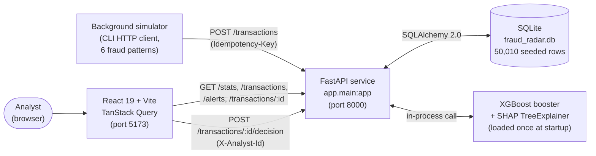
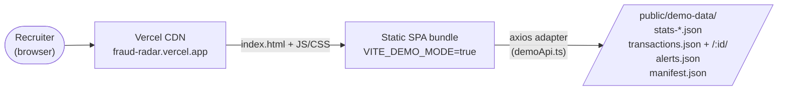
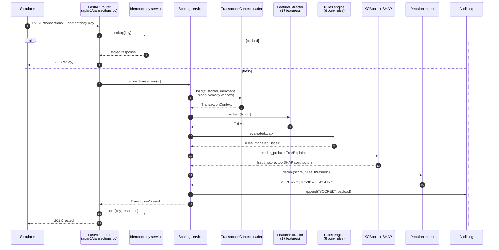
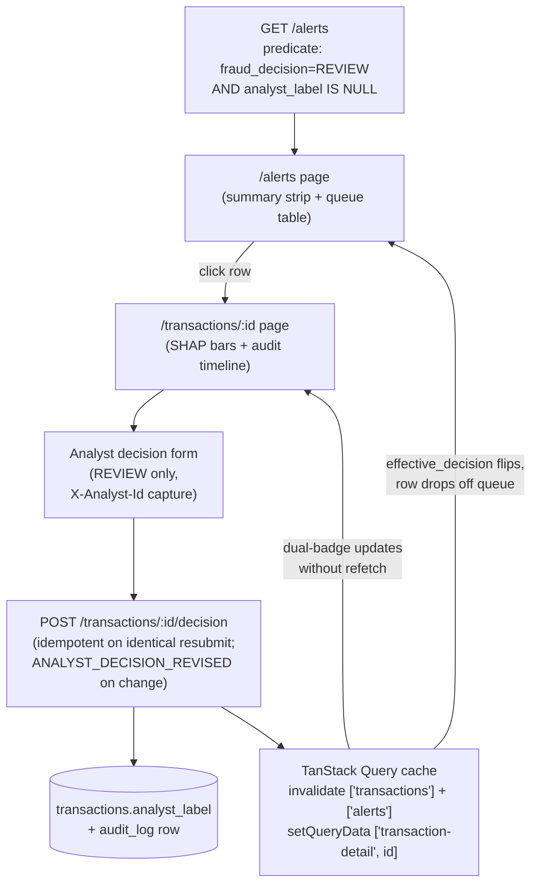
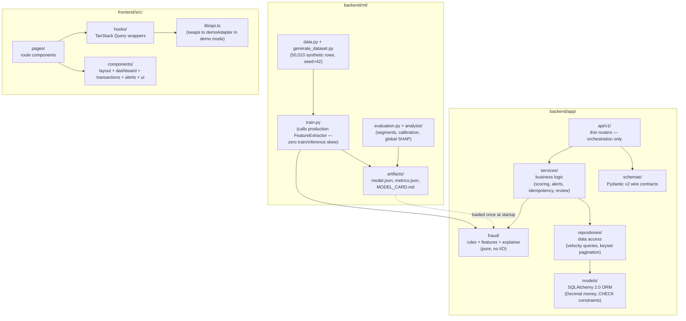

# Fraud Radar — Architecture

> Companion document to the [README](../README.md) and the ADRs under
> [`docs/adr/`](adr/). Diagrams render natively on GitHub via Mermaid.

This document is the one-page mental model of the system. It covers:

1. The runtime topology (live mode and public-demo mode)
2. The request path for a single scored transaction
3. The data flow for the analyst-review loop
4. The layered code structure

The detail of any particular slice lives in its own ADR. This page
exists so a reviewer can orient themselves in under two minutes.

---

## 1. Runtime topology

Two deployment shapes ship from the same codebase. Local development
runs the full live stack; the public Vercel demo serves a frozen
snapshot and never touches a backend.

### Live (local development)

### Public demo (Vercel, zero-cost, zero-backend)

The same React tree runs in both modes. The branch lives at exactly
one layer — `src/lib/api.ts` swaps in `demoAdapter` when the env flag
is set, and every hook stays unchanged. See
[`docs/adr/PHASE_4A_DEMO_SCOPE.md`](adr/PHASE_4A_DEMO_SCOPE.md) for
the locked snapshot contract.

---

## 2. Request path: one transaction, end-to-end

This is what happens between a simulator `POST` and the row appearing
on the dashboard.

Service-layer latency (Phase 3C measurement): **p50 = 3.7 ms · p95 =
5.8 ms** end-to-end. Full methodology in
[`backend/ml/artifacts/latency_metrics.json`](../backend/ml/artifacts/latency_metrics.json).

---

## 3. Analyst-review loop

Once a transaction lands in `REVIEW`, it surfaces on the alerts queue
and waits for a human verdict. The cache wiring below is what makes
"submit verdict → row vanishes from queue" feel instant.

The `effective_decision` field on the detail envelope preserves the
model's verdict verbatim while reflecting any analyst override, so
the audit trail and the operational view never disagree. See
[`docs/adr/PHASE_3G_DESIGN.md`](adr/PHASE_3G_DESIGN.md) for the
envelope shape and override semantics, and
[`docs/adr/PHASE_3H_DESIGN.md`](adr/PHASE_3H_DESIGN.md) for the queue
predicate and score-bucket boundaries.

---

## 4. Layered code structure

The backend is a layered monolith — the seams are placed so any one
layer could be pulled into its own service later without rewriting
the others.

The arrow from `ART` to `fraud/` is the only cross-tree dependency at
runtime: the FastAPI app boots, loads `model.json` and the SHAP
explainer once, and reuses them across every request. Training runs
out-of-band and writes new artifacts that the app picks up on its
next restart.

---

## See also

- [`docs/adr/PHASE_3_DESIGN.md`](adr/PHASE_3_DESIGN.md) — rules
  engine, ingestion endpoint, idempotency, scoring pipeline,
  simulator.
- [`docs/adr/PHASE_3E_DESIGN.md`](adr/PHASE_3E_DESIGN.md) — dashboard
  aggregate endpoints + CORS posture + frontend foundation.
- [`docs/adr/PHASE_3F_DESIGN.md`](adr/PHASE_3F_DESIGN.md) —
  transactions list + keyset pagination + filter contract.
- [`docs/adr/PHASE_3G_DESIGN.md`](adr/PHASE_3G_DESIGN.md) — detail
  envelope + analyst-override endpoint + `effective_decision`
  semantics.
- [`docs/adr/PHASE_3H_DESIGN.md`](adr/PHASE_3H_DESIGN.md) — alerts
  queue + queue predicate + score-bucket boundaries.
- [`docs/adr/PHASE_4A_DEMO_SCOPE.md`](adr/PHASE_4A_DEMO_SCOPE.md) —
  zero-cost Vercel-only architecture + snapshot contract.
- [`backend/ml/MODEL_CARD.md`](../backend/ml/MODEL_CARD.md) — segment
  metrics, calibration, global SHAP, limitations.
